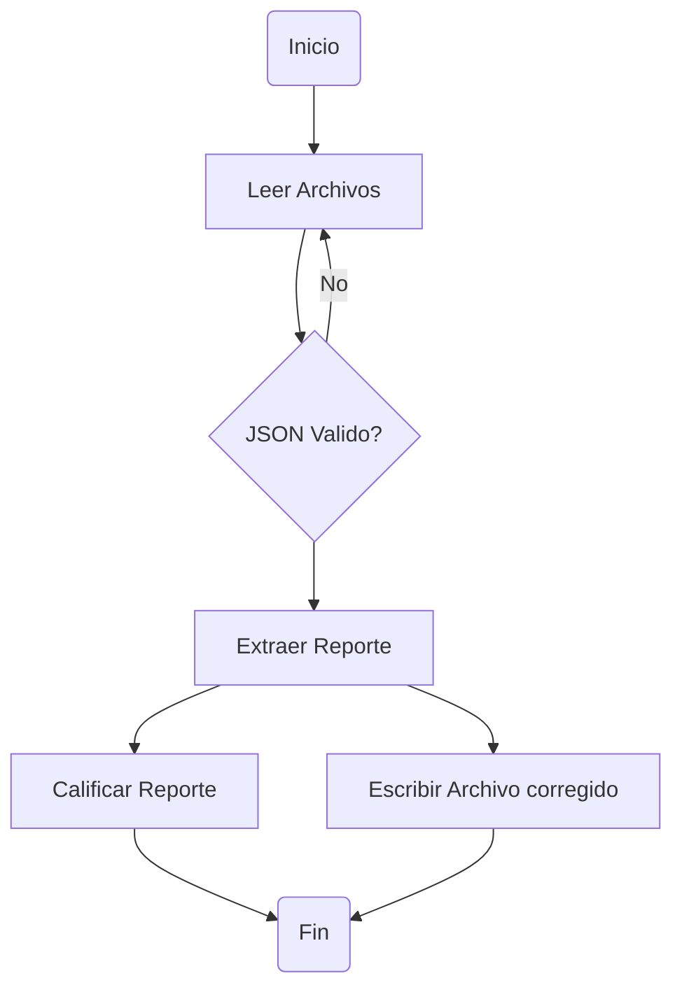
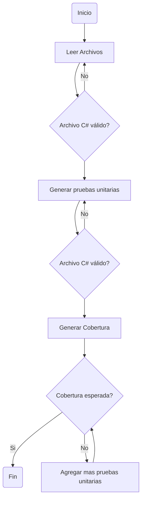
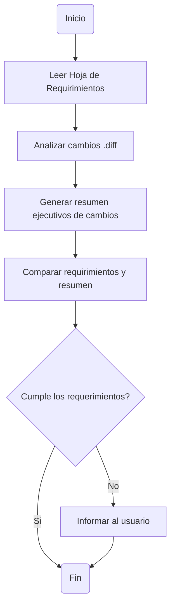

## Agent Codigo Limpio

### Sub agentes

- Extraccion de Reporte: Lee el codigo a evaluar y genera el reporte en formato JSON.
- Correccion de Codigo: Genera el código limpio generado del reporte extraído

### Herramientas

- Leer Archivo
- Escribir Archivo
- Extraer Reporte

## Agente Para Pruebas Unitarias

### Sub Agentes

- Generador de Pruebas Unitarias
- Validación y Cobertura para Pruebas Unitarias

### Herramientas

- Leer Archivo
- Escribir Archivo
- Compilar y ejecutar pruebas unitarias

## Agente Validador de Requirimientos

### Herramientas

- Leer Archivo
- Leer Tiquetes (GitHub, Jira)
- GitHub MCP

### Sub Agentes

- Evaludor de requirimientos