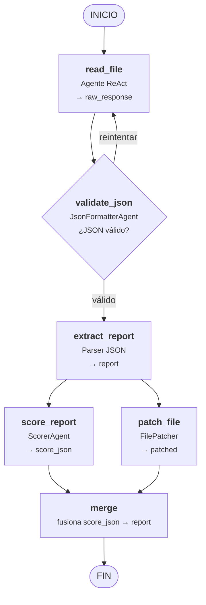
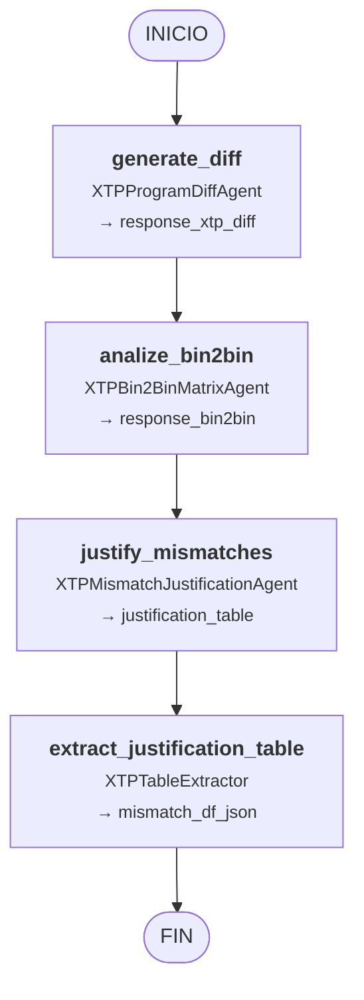
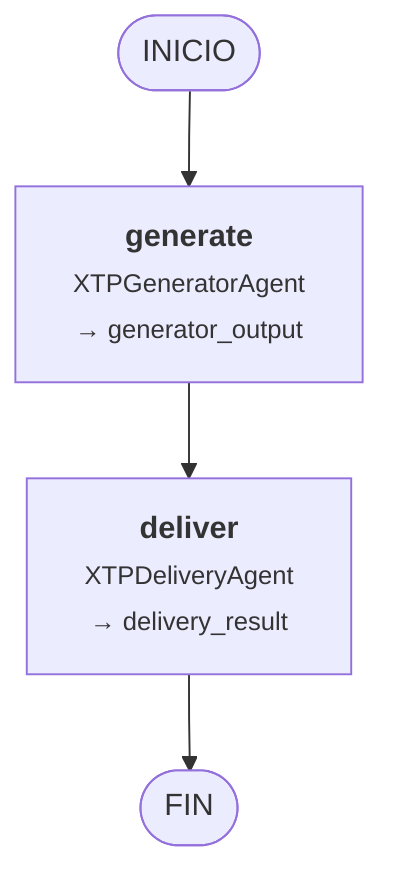

# Pipelines LangGraph — Diagramas Mermaid

## 1 · Pipeline del Reporter de Código Limpio
**Archivo:** `CleanCodeReporter/GraphAgent.py` · **Estado:** `GraphState` · **Entrada:** `CleanCodeReporter/GraphAgent.run()`

Analiza un archivo C# en busca de code smells con un bucle de reintento ante JSON inválido, luego ejecuta la calificación y el parcheado del archivo en paralelo antes de fusionar los resultados.

---

## 2 · Pipeline de Análisis XTP
**Archivo:** `XTPAnalyser/AnalysisGraph.py` · **Estado:** `XTPAnalysisState` · **Entrada:** `XTPAnalyser/Main.py`

Compara dos programas XTP, analiza su matriz Bin2Bin, justifica cada discrepancia y extrae una tabla de justificación estructurada.

---

## 3 · Pipeline de Generación XTP
**Archivo:** `XTPAnalyser/graph.py` · **Estado:** `XTPState` · **Entrada:** `XTPAnalyser/ProgramGeneration.py`

Genera dos programas XTP sintéticos y una matriz de correlación Bin2Bin, luego escribe los archivos resultantes en disco.

