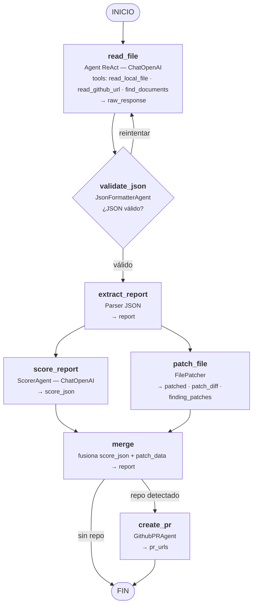
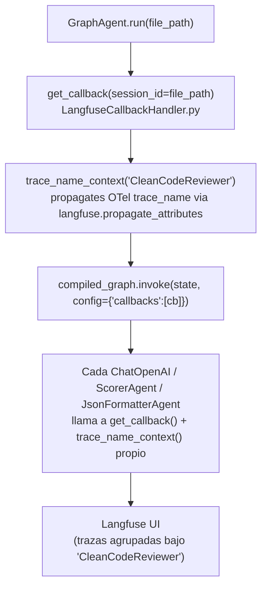
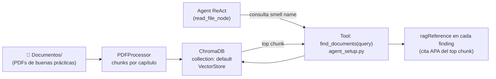
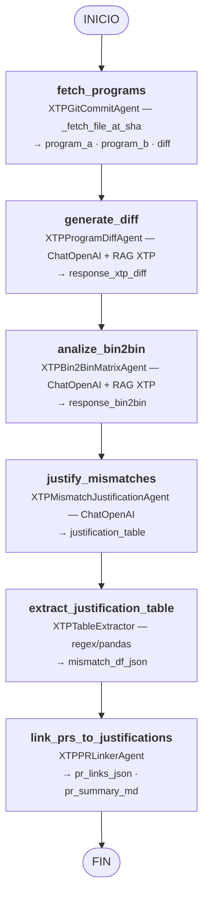
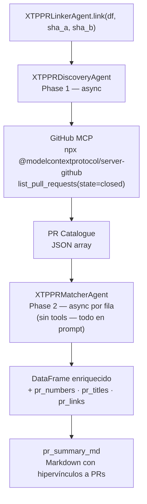
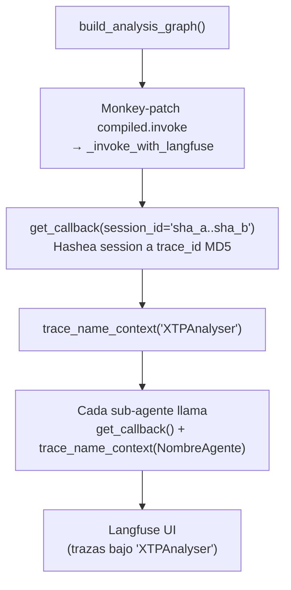
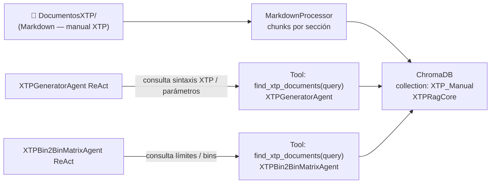
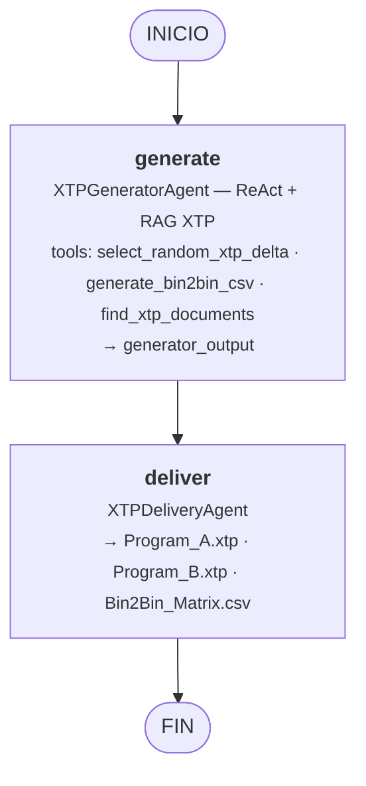
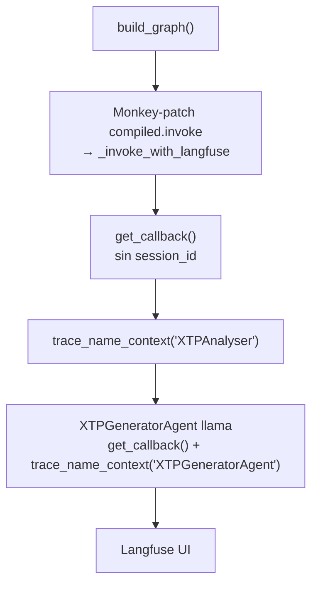

# Pipelines LangGraph — Diagramas Mermaid

## 1 · Pipeline del Reporter de Código Limpio
**Archivo:** `CleanCodeReporter/GraphAgent.py` · **Estado:** `GraphState` · **Entrada:** `CleanCodeReporter/GraphAgent.run()`

Analiza un archivo C# en busca de code smells con un bucle de reintento ante JSON inválido, luego ejecuta la calificación y el parcheado del archivo en paralelo antes de fusionar los resultados. Opcionalmente crea una PR de GitHub por cada hallazgo.

### Inyección de Langfuse — CleanCodeReporter

### RAG — CleanCodeReporter

---

## 2 · Pipeline de Análisis XTP
**Archivo:** `XTPAnalyser/AnalysisGraph.py` · **Estado:** `XTPAnalysisState` · **Entrada:** `XTPAnalyser/Main.py`

Obtiene los dos programas XTP desde GitHub por commit SHA, analiza su diferencia y la matriz Bin2Bin, justifica cada discrepancia, extrae una tabla estructurada y la enriquece con referencias a Pull Requests.

### XTPPRLinkerAgent — Detalle interno

### Inyección de Langfuse — XTP Analyser

### RAG — XTP Analyser

---

## 3 · Pipeline de Generación XTP
**Archivo:** `XTPAnalyser/graph.py` · **Estado:** `XTPState` · **Entrada:** `XTPAnalyser/ProgramGeneration.py`

Recibe un programa XTP de entrada, aplica un delta paramétrico aleatorio para generar el Programa B con su matriz Bin2Bin CSV, y escribe los archivos resultantes en disco.

### Inyección de Langfuse — XTP Generation

