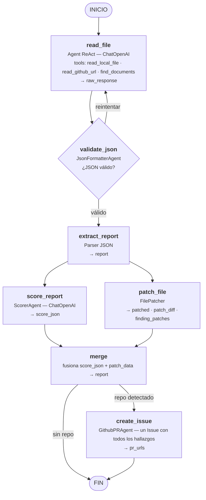
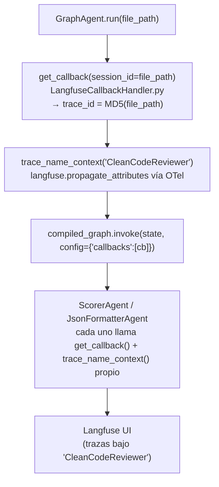
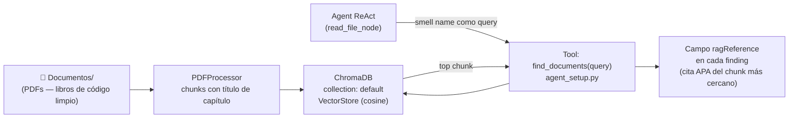
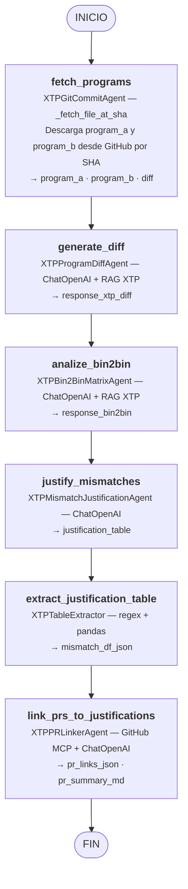
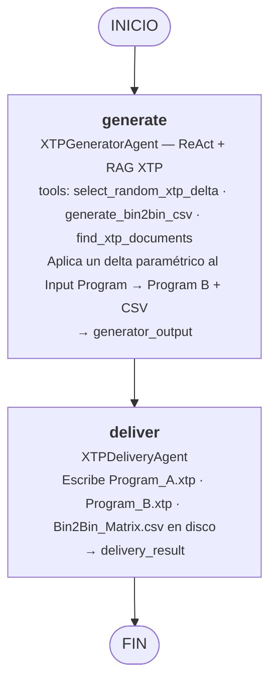
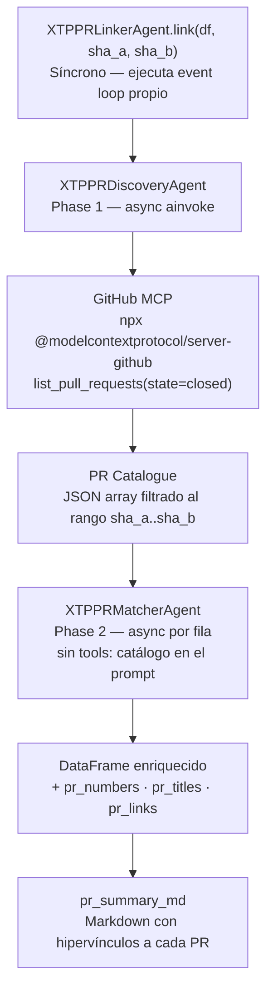
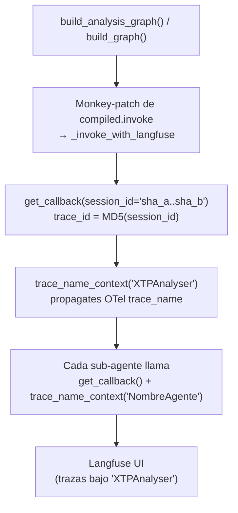
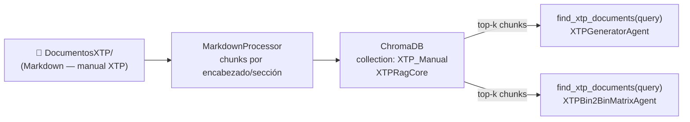

# prueba_langchain — Guía de Arquitectura y Configuración

Este repositorio contiene dos sistemas agénticos construidos sobre **LangGraph + LangChain**:

| Sistema | Carpeta | Descripción |
|---|---|---|
| **CleanCodeReviewer** | `CleanCodeReporter/` | Analiza archivos C# en busca de code smells, los califica y abre Issues en GitHub solicitando las correcciones |
| **XTP Analyser** | `XTPAnalyser/` | Compara programas XTP, analiza matrices Bin2Bin y vincula discrepancias a PRs de GitHub |

---

## 🛠️ Instalación

### Paso 1 — Instalar Ollama (opcional, para uso local)

1. Descarga el instalador oficial desde [ollama.com](https://ollama.com).
2. Ejecuta el archivo descargado y completa el asistente de instalación.
3. Para descargar el modelo Llama 3.1 8B:
   ```bash
   ollama run llama3.1:8b
   ```

### Paso 2 — Configurar el entorno Python

Activa el entorno virtual e instala las dependencias:

```bash
.\Activate.ps1
pip install -r Requirements.txt
```

### Paso 3 — Variables de entorno

Copia `.env.example` a `.env` y rellena los valores:

```env
# LLM (DeepSeek por defecto)
LLM_MODEL=deepseek-chat
LLM_API_KEY=sk-...
LLM_API_BASE=https://api.deepseek.com/v1

# Langfuse (observabilidad — opcional)
LANGFUSE_SECRET_KEY=sk-lf-...
LANGFUSE_PUBLIC_KEY=pk-lf-...
LANGFUSE_HOST=https://cloud.langfuse.com

# GitHub (para abrir Issues de code-smell y consultar repositorios XTP)
GITHUB_PERSONAL_ACCESS_TOKEN=ghp_...
```

---

## 🏗️ Arquitectura

### CleanCodeReviewer

#### Grafo LangGraph



**Archivos clave:**

| Archivo | Rol |
|---|---|
| [`CleanCodeReporter/GraphAgent.py`](CleanCodeReporter/GraphAgent.py) | Definición del grafo, todos los nodos y aristas |
| [`CleanCodeReporter/agent_setup.py`](CleanCodeReporter/agent_setup.py) | Instancia el Agent ReAct con sus tres tools |
| [`CleanCodeReporter/Agent.py`](CleanCodeReporter/Agent.py) | Clase `Agent` — envuelve el ReAct loop |
| [`Helpers/JsonFormatterAgent.py`](Helpers/JsonFormatterAgent.py) | LLM de un solo turno que convierte texto libre a JSON schema |
| [`Helpers/ScorerAgent.py`](Helpers/ScorerAgent.py) | LLM de un solo turno que calcula nota y justificación |
| [`Helpers/FilePatcher.py`](Helpers/FilePatcher.py) | Aplica unified diffs al archivo fuente |
| [`CleanCodeReporter/GithubPRAgent.py`](CleanCodeReporter/GithubPRAgent.py) | Abre un Issue en GitHub con todos los hallazgos y sus diffs propuestos |

#### Inyección de Langfuse



- **`get_callback(session_id)`** — retorna un `langfuse.langchain.CallbackHandler` sólo cuando las tres variables `LANGFUSE_SECRET_KEY`, `LANGFUSE_PUBLIC_KEY` y `LANGFUSE_HOST` están definidas. Si falta alguna, retorna `None` y el sistema funciona sin observabilidad.
- **`trace_name_context(name)`** — context manager síncrono que llama `langfuse.propagate_attributes(trace_name=name)` para asignar el nombre a la traza activa en el UI de Langfuse (v4).

#### RAG — Documentos de buenas prácticas



- El agente llama `find_documents(query)` durante el análisis y copia la referencia APA retornada en el campo `ragReference` de cada finding.
- La colección es compartida (persistida en `.chroma/`) y se recarga al inicio.

---

### XTP Analyser

#### Pipeline de Análisis (`AnalysisGraph.py`)



#### Pipeline de Generación (`graph.py`)



#### XTPPRLinkerAgent — Detalle interno



**Archivos clave:**

| Archivo | Rol |
|---|---|
| [`XTPAnalyser/AnalysisGraph.py`](XTPAnalyser/AnalysisGraph.py) | Grafo de 6 nodos — análisis completo desde SHA hasta tabla con PRs |
| [`XTPAnalyser/graph.py`](XTPAnalyser/graph.py) | Grafo de 2 nodos — generación de programas XTP sintéticos |
| [`XTPAnalyser/Agents/XTPGitCommitAgent.py`](XTPAnalyser/Agents/XTPGitCommitAgent.py) | Descarga archivos XTP de GitHub por commit SHA |
| [`XTPAnalyser/Agents/XTPProgramDiffAgent.py`](XTPAnalyser/Agents/XTPProgramDiffAgent.py) | Analiza el diff entre dos programas XTP |
| [`XTPAnalyser/Agents/XTPBin2BinMatrixAgent.py`](XTPAnalyser/Agents/XTPBin2BinMatrixAgent.py) | Analiza la matriz de transición Bin2Bin |
| [`XTPAnalyser/Agents/XTPMismatchJustificationAgent.py`](XTPAnalyser/Agents/XTPMismatchJustificationAgent.py) | Justifica cada discrepancia con física de silicio |
| [`XTPAnalyser/Agents/XTPTableExtractor.py`](XTPAnalyser/Agents/XTPTableExtractor.py) | Extrae la tabla Markdown a un DataFrame pandas |
| [`XTPAnalyser/Agents/XTPPRLinkerAgent.py`](XTPAnalyser/Agents/XTPPRLinkerAgent.py) | Vincula discrepancias a PRs vía GitHub MCP |
| [`XTPAnalyser/Agents/XTPGeneratorAgent.py`](XTPAnalyser/Agents/XTPGeneratorAgent.py) | Genera Program B + matriz Bin2Bin con delta paramétrico |
| [`XTPAnalyser/Agents/XTPDeliveryAgent.py`](XTPAnalyser/Agents/XTPDeliveryAgent.py) | Escribe los archivos .xtp y .csv en disco |

#### Inyección de Langfuse — XTP



La integración de Langfuse se realiza en **dos niveles**:

1. **Nivel de grafo** — `build_analysis_graph()` reemplaza `compiled.invoke` con una versión que adjunta automáticamente el callback y establece el nombre de traza, sin requerir ningún cambio en el código que invoca el grafo.
2. **Nivel de sub-agente** — cada agente interno (`XTPBin2BinMatrixAgent`, `XTPGeneratorAgent`, etc.) llama a `get_callback()` y usa `trace_name_context()` con su propio nombre para que cada llamada LLM aparezca como span hijo en la traza de Langfuse.

#### RAG — Manual XTP



- **`XTPRagCore`** (`RAG/xtp_rag.py`) usa `MarkdownProcessor` para indexar los manuales en Markdown de `DocumentosXTP/` en una colección ChromaDB independiente (`XTP_Manual`), separada de la colección de buenas prácticas del CleanCodeReviewer.
- Tanto `XTPGeneratorAgent` como `XTPBin2BinMatrixAgent` exponen la misma tool `find_xtp_documents` que consulta esta colección antes de razonar sobre sintaxis XTP, límites paramétricos o tablas de binning.

---

## 📁 Estructura del Proyecto

```
prueba_langchain/
├── CleanCodeReporter/
│   ├── GraphAgent.py          # Grafo LangGraph — 7 nodos
│   ├── Agent.py               # Clase Agent — ReAct loop
│   ├── agent_setup.py         # Herramientas del agente + prompt
│   ├── GithubPRAgent.py       # Apertura de Issues en GitHub con hallazgos
│   ├── Rag.py                 # RagCore — PDFs de buenas prácticas
│   └── dash_app.py            # UI Dash
├── XTPAnalyser/
│   ├── AnalysisGraph.py       # Grafo de análisis — 6 nodos
│   ├── graph.py               # Grafo de generación — 2 nodos
│   ├── Main.py                # Punto de entrada — análisis
│   ├── ProgramGeneration.py   # Punto de entrada — generación
│   └── Agents/
│       ├── XTPGitCommitAgent.py
│       ├── XTPProgramDiffAgent.py
│       ├── XTPBin2BinMatrixAgent.py
│       ├── XTPMismatchJustificationAgent.py
│       ├── XTPTableExtractor.py
│       ├── XTPPRLinkerAgent.py
│       ├── XTPGeneratorAgent.py
│       └── XTPDeliveryAgent.py
├── Helpers/
│   ├── LangfuseCallbackHandler.py   # get_callback() + trace_name_context()
│   ├── JsonFormatterAgent.py        # Reformateador LLM → JSON schema
│   ├── ScorerAgent.py               # Motor de calificación LLM
│   ├── FilePatcher.py               # Aplicación de unified diffs
│   └── Logger.py
├── RAG/
│   ├── rag_config.py          # Configuración de carpeta y colección
│   ├── pdf_processor.py       # Chunking de PDFs
│   ├── markdown_processor.py  # Chunking de Markdown
│   ├── vector_store.py        # ChromaDB wrapper
│   └── xtp_rag.py             # XTPRagCore — colección XTP_Manual
├── Documentos/                # PDFs de libros de código limpio
├── DocumentosXTP/             # Manuales XTP en Markdown
├── Programas/                 # Archivos XTP generados (.xtp, .csv)
├── Estructuras/               # TypedDicts y schemas JSON
├── Diagrams_V2.md             # Diagramas Mermaid detallados
└── .env.example               # Plantilla de variables de entorno
```

---

## 🚀 Ejecución

### CleanCodeReviewer

```bash
python -m CleanCodeReporter.GraphAgent  # análisis de un archivo C#
python CleanCodeReporter/dash_app.py    # interfaz Dash en http://localhost:8050
```

### XTP Analyser — Generación

```bash
python XTPAnalyser/ProgramGeneration.py
```

### XTP Analyser — Análisis

```bash
python XTPAnalyser/Main.py
```

---

## ✅ Beneficios de la Configuración

- **Observabilidad granular:** Cada llamada LLM aparece como span hijo en Langfuse, agrupada por pipeline y sub-agente.
- **RAG desacoplado:** El CleanCodeReviewer y el XTP Analyser usan colecciones ChromaDB completamente independientes.
- **Langfuse opcional:** Si las variables `LANGFUSE_*` no están definidas, `get_callback()` retorna `None` y todos los pipelines funcionan sin modificaciones.
- **Sin dependencia de infraestructura remota para LLM:** Se puede apuntar a cualquier endpoint OpenAI-compatible vía `LLM_API_BASE`.
